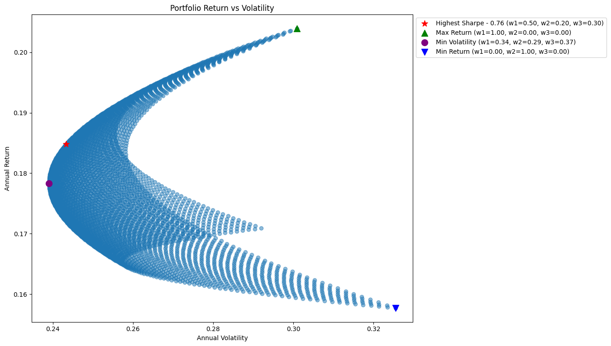

# 📊 Finance Analytics Portfolio with Python & AI

## Overview

Welcome to my personal portfolio of financial analytics projects, built using Python. This repository showcases **data-driven case studies** in portfolio modeling, market analysis, and investment research. Each project demonstrates real-world data analysis workflows, exploratory data analysis (EDA), financial modeling, and custom visualizations using industry-standard tools.

> 🧠 **Note**: While case study prompts were generated with AI assistance, all **code implementation**, **analysis**, and **interpretation** are entirely my original work.

---

## 🔍 Key Projects

### **[Efficient Frontier Optimization](./4_efficient_frontier/)**

📌 My favorite and most comprehensive case study.  
This project demonstrates:

- Portfolio construction using historical asset returns
- Risk-return optimization with the **Efficient Frontier** model
- Custom **matplotlib visualizations** of Sharpe ratios, volatility, and return tradeoffs
- Use of **pandas** for financial return calculations and cleaning

**📷 Sample Visualization**  

---

## 💼 Skills Demonstrated

- 📈 **EDA** of financial datasets (log returns, drawdowns, correlations)
- 🔁 Time series preprocessing (resampling, rolling averages)
- 📊 Advanced plotting with **matplotlib**, **seaborn**, and **Plotly**
- 🧮 Financial modeling: portfolio optimization, CAPM, value-at-risk
- 🧹 Robust data wrangling and cleaning using **pandas**

---

## 🧰 Tech Stack

| Purpose | Tools & Libraries |
|--------|------------------|
| Data Handling | `pandas`, `numpy`, `yfinance`, `pandas-datareader` |
| Visualization | `matplotlib`, `seaborn`, `plotly` |
| Analytics & Stats | `scipy`, `statsmodels` |
| Risk/Portfolio Modeling | `pyfolio`, `cvxpy` (where applicable) |

---

## 📚 What I’ve Learned

- Cleaning and structuring financial time series for analysis
- Creating reusable EDA workflows for return and volatility analysis
- Applying **finance concepts** (Sharpe ratio, diversification, correlation matrices)
- Balancing interpretability vs. accuracy in model design

---

## 📬 Contact

Want to collaborate or chat about finance, analytics, or Python?  
👉 Connect with me on [LinkedIn](linkedin.com/in/ondřej-kutil-342a97256) or email me at `kutil.ondra@outlook.cz`.

---

## ⚠️ Disclaimer

All content is for **educational and demonstration purposes only**. Nothing here constitutes investment advice.
